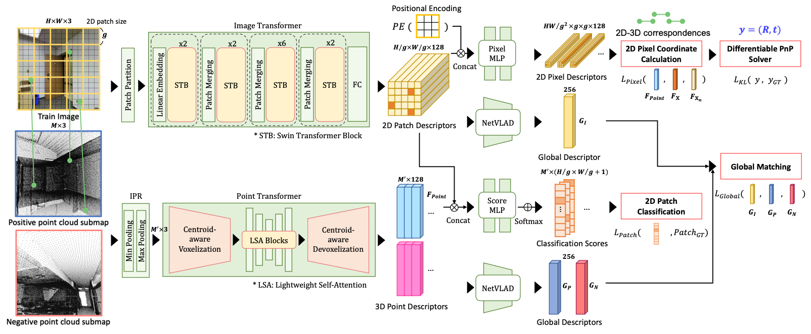

# EP2P-Loc: End-to-End 3D Point to 2D Pixel Localization for Large-Scale Visual Localization


Visual localization is the task of estimating a 6-DoF camera pose of a query image within a provided 3D reference map. Thanks to recent advances in various 3D sensors, 3D point clouds are becoming a more accurate and affordable option for building the reference map, but research to match the points of 3D point clouds with pixels in 2D images for visual localization remains challenging. Existing approaches that jointly learn 2D-3D feature matching suffer from low inliers due to representational differences between the two modalities, and the methods that bypass this problem into classification have an issue of poor refinement. In this work, we propose **EP2P-Loc**, a novel large-scale visual localization method that mitigates such appearance discrepancy and enables end-to-end training for pose estimation. To increase the number of inliers, we propose a simple algorithm to remove invisible 3D points in the image, and find all 2D-3D correspondences without keypoint detection. To reduce memory usage and search complexity, we take a coarse-to-fine approach where we extract patch-level features from 2D images, then perform 2D patch classification on each 3D point, and obtain the exact corresponding 2D pixel coordinates through positional encoding. Finally, for the first time in this task, we employ a differentiable PnP for end-to-end training. In the experiments on newly curated large-scale indoor and outdoor benchmarks based on [2D-3D-S](http://buildingparser.stanford.edu/dataset.html) and [KITTI](https://www.cvlibs.net/datasets/kitti/eval_odometry.php), we show that our method achieves the state-of-the-art performance compared to existing visual localization and image-to-point cloud registration methods.


## Requirements
* Ubuntu 16.04
* Python 3.8
```
pip install -r requirements.txt
```


## Dataset
### Download datasets
* [2D-3D-S and S3DIS](http://buildingparser.stanford.edu/dataset.html)
* [KITTI](https://www.cvlibs.net/datasets/kitti/eval_odometry.php)


### Preprocessing
```
cd datasets

# 2D-3D-S
python preprocess_2d3ds.py --data_path <2D-3D-S_path> --s3dis_path <S3DIS_path> --cache_path <cache_path> --save_path <save_path>

# KITTI
python preprocess_kitti.py --data_path <KITTI_path> --save_path <save_path>
```


## Citation
```
@INPROCEEDINGS{EP2PLoc2023ICCV,
  author = {Kim, Minjung and Koo, Junseo and Kim, Gunhee},
  title = {EP2P-Loc: End-to-End 3D Point to 2D Pixel Localization for Large-Scale Visual Localization},
  booktitle = {International Conference on Computer Vision (ICCV)},
  year = {2023}
}
```


## TODO
* paper link(arXiv)
* OS / Python / Requirements check
* (shorter) model explanation
* (higher) images/network.png resolution
* code results (table, graph, image, ...)
* code running script/command
